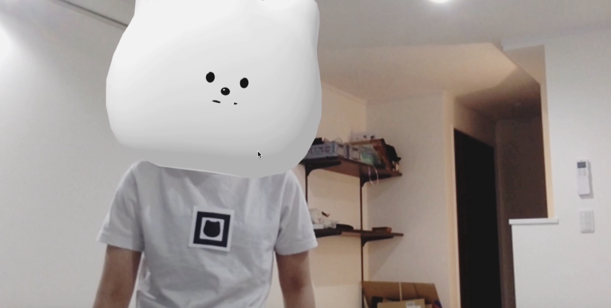
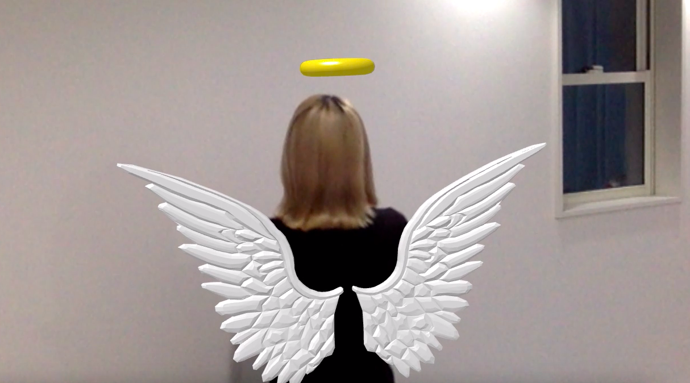

# ただ「もねたん」になりたかった

webARを実現するAR.jsを用いて可愛らしいクマのキャラクター「もねたん」になるプロジェクト。 
Tシャツに貼ってあるARマーカーを認識すると顔の位置にもねたんの顔の3Dモデルが出現して誰でももねたんに変身することができる。 
webで動くのでアプリのDLなど必要なくウェブで遊べる 
wip

# あとついでに羽根も生やしたかった
翼の折れてないエンジェル。 
現在three.jsでpostprocessをつけるなどのアップデート中で
将来的には服としての商品化を目論んでいます。
